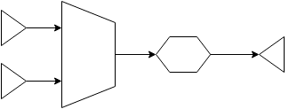

# Rivers 

[](https://travis-ci.org/drborges/rivers)

Data Stream Processing API for GO

# Overview

Rivers provide a simple though powerful API for processing streams of data built on top of `goroutines`, `channels` and the [pipeline pattern](https://blog.golang.org/pipelines).

```go
err := rivers.From(NewGithubRepositoryProducer(httpClient)).
	Filter(hasForks).
	Filter(hasRecentActivity).
	Drop(ifStarsCountIsLessThan(50)).
	Map(extractAuthorInformation).
	Batch(200).
	Each(saveBatch).
	Drain()
```

With a few basic building blocks based on the `Producer-Consumer` model, you can compose and create complex data processing pipelines for solving a variety of problems.

# Building Blocks

A particular stream pipeline may be built composing building blocks such as `producers`,  `consumers`,  `transformers`, `combiners` and `dispatchers`.

### Stream 

Streams are simply readable or writable channels where data flows through `asynchronously`. They are usually created by `producers` providing data from a particular data source, for example `files`, `network` (socket data, API responses), or even as simple as regular `slice` of data to be processed.

Rivers provide a `stream` package with a constructor function for creating streams as follows:

```go
capacity := 100
readable, writable := stream.New(capacity)
```

Streams are buffered and the `capacity` parameter dictates how many items can be produced into the stream without being consumed until the producer is blocked. This blocking mechanism is natively implemented by Go channels, and is a form of `back-pressuring` the pipeline.

### Producers 

Asynchronously emits data into a stream. Any struct implementing the `stream.Producer` interface can be used as a producer in rivers.

```go
type Producer interface {
	Produce() stream.Readable
}
```

Producers implement the [pipeline pattern](https://blog.golang.org/pipelines) in order to asynchronously produce items that will be eventually consumed by a further stage in the pipeline.

A good producer implementation takes care of 3 important aspects:

1. Checks if rivers context is still opened before emitting any item
2. Defers the recover function from rivers context as part of the goroutine execution
3. Closes the writable stream at the end of the go routine. By closing the channel further stages of the pipeline know when their work is done.

Lets see how one would go about converting a slice of numbers into a stream with a simple Producer implementation:

```go
type NumbersProducer struct {
	context stream.Context
	numbers []int
}

func (producer *NumbersProducer) Produce() stream.Readable {
	readable, writable := stream.New(len(producer.numbers))

	go func() {
		defer producer.context.Recover()
		defer close(writable)

		for _, n := range producer.numbers {
			select {
			case <-producer.context.Closed:
				return
			default:
				writable <- n
			}
		}
	}()

	return readable
}
```

The code above is a complaint `rivers.Producer` implementation and it gives the developer full control of the process. Rivers also provides a partial producer implementation that you can use for most cases: `producers.Observable`.

Our producer implementation in terms of an observable would then look like:

```go
func NewNumbersProducer(context stream.Context, numbers []int) stream.Producer {
	return &Observable{
		Context:  context,
		Capacity: len(numbers),
		Emit: func(w stream.Writable) {
			for _, n := range numbers {
				select {
				case <-context.Closed:
					return
				default:
					writable <- n
				}
			}
		},
	}
}
```

You can get a hold of a `stream.Context` like so: `context := rivers.NewContext()`

### Consumers 

Consumes data from a particular stream. Consumers blocks the process until there is no more data to be consumed out of the stream.

You can use consumers to collect the items reaching the end of the pipeline, or any errors that might have happened during the execution.

It is very likely you will most often need a final consumer in your pipeline for waiting for the pipeline result before moving on.

Examples of consumers would be:

1. `Drainers` which block draining the stream until there is no more data flowing through and returning any possible errors.

2. `Collectors` collect all items that reached the end of the pipeline and any possible error.

Say we have a stream where instances of `Person` are flowing through, then you can collect items off the stream like so:

```go
type Person struct {
	Name string
}

diego := Person{"Diego"}
borges := Person{"Borges"}

items, err := rivers.FromData(diego, borges).Collect()
item, err := rivers.FromData(diego, borges).CollectFirst()
item, err := rivers.FromData(diego, borges).CollectLast()

var people []Person
err := rivers.FromData(diego, borges).CollectAs(&people)

var diego Person
err := rivers.FromData(diego, borges).CollectFirstAs(&diego)

var borges Person
err := rivers.FromData(diego, borges).CollectLastAs(&diego)
```

### Transformers 

Reads data from a particular stream applying a transformation function to it, optionally forwarding the result to an output channel. Transformers are both `Producers` and `Consumers`.

Basic Stream Transformation Pipeline: `Producer -> Transformer -> Consumer`


### Combiners 

Combines two or more streams into a single stream. Combiners may apply different strategies such as FIFO, Zip, etc.

Combining Streams: `Producers -> Combiner -> Transformer -> Consumer`



### Dispatchers 

Forwards data from a particular stream to one or more streams. Dispatchers may dispatch data conditionally such as the rivers Partition operation.

Dispatching to multiple streams: `Producer -> Dispatcher -> Transformers -> Consumers`


# Examples

```go
evensOnly := func(data stream.T) bool { return data.(int) % 2 == 0 }
addOne := func(data stream.T) stream.T { return data.(int) + 1 }

data, err := rivers.FromRange(1, 10).Filter(evensOnly).Map(addOne).Collect()

fmt.Println("data:", data)
fmt.Println("err:", err)

// Output:
// data: []stream.T{3, 5, 7, 9, 11}
// err: nil
```

# Built-in Filters and Mappers

# Custom Producers

# Custom Transformers

# The Cancellation Problem

# Troubleshooting

# Contributing

# License